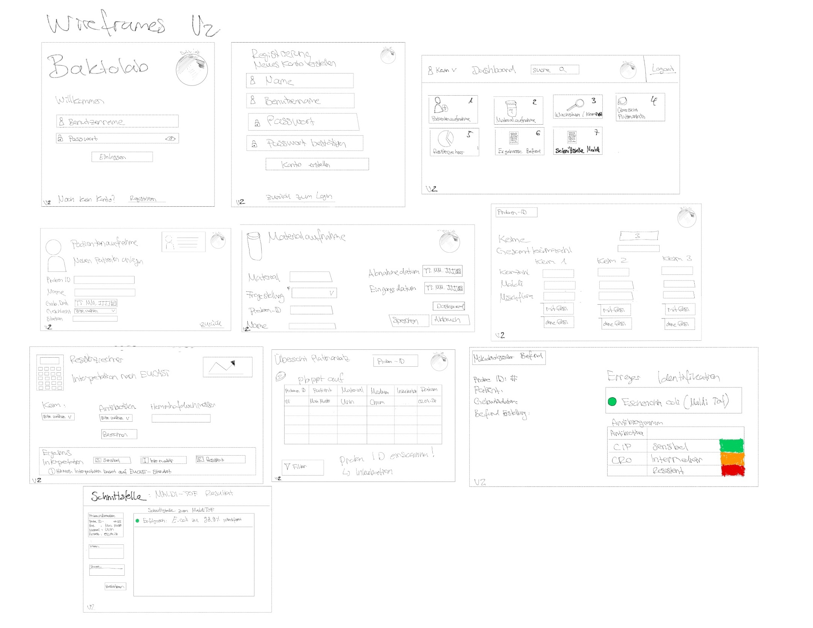

## Entwicklung der Wireframes

Version 0 zeigt die Grundstruktur der Anwendung mit Login, Dashboard sowie Patienten- und Materialaufnahme.

Version 1 erweitert diese Struktur um zusätzliche Funktionen wie den Resistenzrechner und eine übersichtlichere Darstellung von Proben und Inkubation.

Version 2 integriert alle Funktionen in einen vollständigen Workflow und ergänzt eine Befund-Seite sowie die MALDI-TOF Integration.

### Wireframe Version 0

### Wireframe Version 1

### Wireframes Version 2

