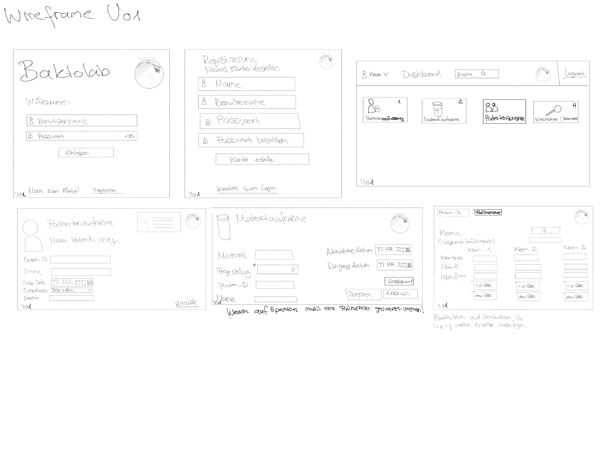
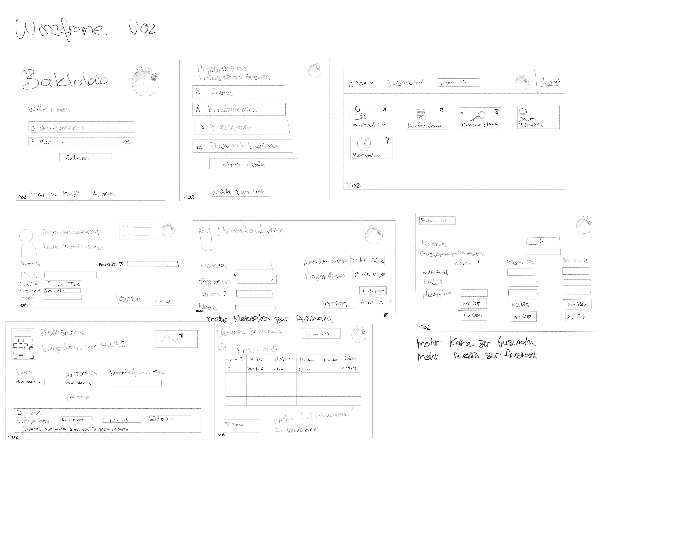
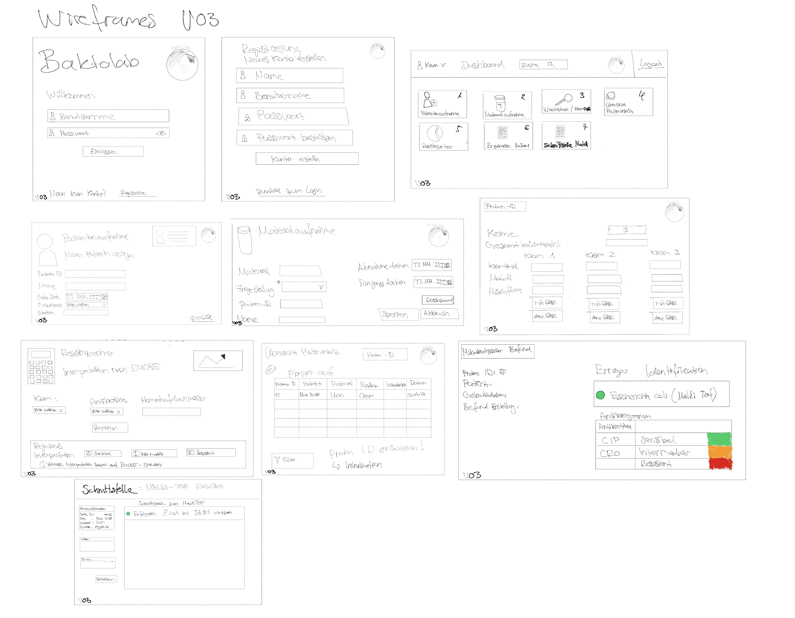

## Entwicklung der Wireframes

### Version 01 (V01) MVP (Minimal Viable Product)

Version 01 stellt die grundlegende Struktur der Anwendung dar. In diesem frühen Stadium liegt der Fokus auf der Planung der wichtigsten Seiten und Funktionen. Dazu gehören Login und Registrierung, ein einfaches Dashboard sowie Eingabemasken für Patientenaufnahme, Materialaufnahme und erste Untersuchungseingaben.

Die Benutzerführung ist noch sehr einfach gehalten und konzentriert sich auf die reine Funktionalität. Ziel ist es, einen ersten Überblick über den Workflow zu schaffen und zu definieren, welche Daten im System erfasst werden sollen. Dies soll auch alles umgesetzt werden.

### Version 02 (V2)

Version 2 baut auf der Grundstruktur von Version 01 auf und erweitert diese um zusätzliche Funktionen und eine klarere Benutzerführung. Das Dashboard wird übersichtlicher gestaltet und um weitere Bereiche ergänzt, wie den Resistenzrechner und eine erste Übersicht des Plattenansatzes.

Zudem werden Icons eingeführt, um die Navigation intuitiver zu machen. Die Eingabemasken werden leicht verbessert und strukturierter dargestellt. Ziel dieser Version ist es, die Anwendung verständlicher und näher an den realen Laboralltag zu bringen.

Dies wird je nach Zeit gegenenfalls zum Teil auch umgesetzt, hat aber für die Abgabe der APP keine Priorität.

### Version 3 (V03)

Version 3 stellt die am weitesten entwickelte Version dar und bildet einen nahezu vollständigen Laborworkflow ab. Alle zentralen Funktionen werden integriert und miteinander verknüpft.

Neu hinzu kommen eine strukturierte Befund-Seite, auf der Patientendaten, Erregeridentifikation und Resistenzresultate zusammengeführt werden, sowie eine Schnittstelle zur Eingabe von MALDI-TOF Resultaten. Zusätzlich wird die Darstellung der Ergebnisse verbessert, beispielsweise durch visuelle Elemente wie ein Ampelsystem.

Ziel dieser Version ist es, ein möglichst realistisches und praxisnahes Laborinformationssystem abzubilden, das den gesamten Prozess von der Datenerfassung bis zur Auswertung unterstützt.
 
Dies kann aber aus Zeitgründen nicht umgesetzt werden bis zur Abgabe.

